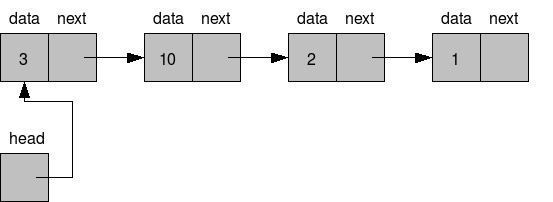

# Estrutura de dados e algoritimos

## Temas

-   [Filas](#filas)
    -   [Stack](#stack)
    -   [Queue](#queue)
    -   [Deque](#deque)
-   [Listas Ligadas](#listas-ligadas)
    -   [Lista Ligada Simples](#lista-ligada-simples)
    -   [Lista Duplamente ligada](#lista-duplamente-ligada)

## Filas

### Stack

Uma stack (pilha) usa o principio **LIFO** (last in first out) ou sejá o ultimo a entrar será o ultimo a sair. Um bom exemplo é uma pilha de livros, onde só podemos retirar o ultimo livro que foi colocado.

### Queue

O Queue (fila) é semelhante a Stack mas com algumas particulariedades, pois no Queue usamos o principio **FIFO** (first in first out) ou seja, o primeiro a entrar é o primeiro a sair. Um exemplo bacana seria a propira fila de um banco, onde o primeiro a chegar é atendido e logo depois sai da fila.

### Deque

O Deque é o pricipio de **LIFO** e **FIFO** tudo junto e misturado. Onde pode se remover tanto o primerio da fila quanto o ultimo da fila. Com Deque podemos fazer também uma fila _circular_.

## Listas Ligadas

### Lista Ligada Simples

Uma lista ligada tipo de estutura de arrays dinamico, o nome _ligada_ quer dizer que o ultimo elemento da lista aponta para proximo como no exemplo abaixo.
Se você reparar vai ver que na imagem tem um head, pois é onde guardamos a posição do primeiro elemento, para assim possamos comecar a fazer uma iteração.

### Lista Duplamente Ligada
